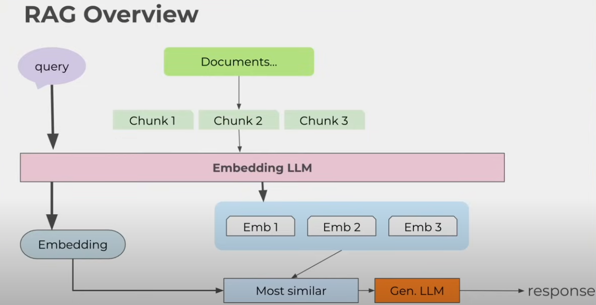
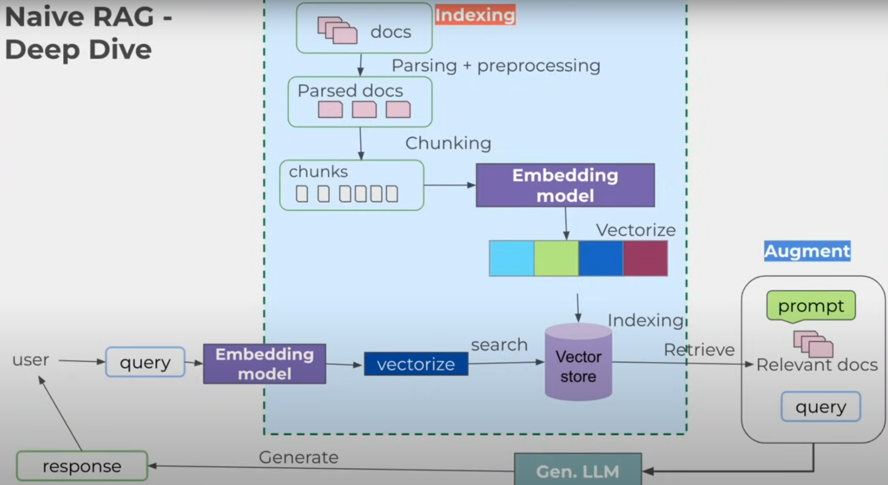

# Retrevial Augmented Generation (RAG)

## Introduction
This sub directory of the GenAI Repository, is to talk and do all things RAG! Furthermore, to track any workings / projects all in one space.

## Projects
Please see the below links in reference to the work that I have done to explore how RAG works with LLMs:

### Naive Rag exercise using OpenAI ChatGPT modelling process 
please see [here](OpenAI_RAG) for how i understood a straightforward process of implementing a naive rag based on a database created in chroma db of text file (.txt) responses from other LLMs about a summary of Wrexham University. 

## RAG exercise using open source Local LLMs via Ollama 

## What is RAG? 
RAG Stands for Retrieval Augmented Generation. Essentially RAG aims to solve potential problems with Large Language Models (LLM's). these problems can be broken down into as follows:
- Hallucination: The concept where a LLM can provide incorrect or misleading information when responding to a query from a user, even when potentially the response returned could appear a warranted response to the untrained eye. This is particularly problematic when the discussions used against the model relate to medical intervention, investing, academic purposes [1]. 

- Enrich Model knowledge: LLM's have absolutely revolutionised the area of AI and Data Science as we know it. However, some or most of these LLM's are only trained up to the production of the LLM. Therefore, any new events or data that has been created since the LLM creation, will mean that the LLM either cannot respond to it, provide erroneous information, orr complete conjecture.

- Well to get proof on where the LLM got its information from: As well as the above two points, RAG can provide additional trust and efficacy between the user and the LLM , with the ability to track where the LLM has got its information from , to provide you with a response and provide evidence on the information used. I like to think of it of a LLM being  "Practice what you preach".

- Gives it specified rich context and the question in which to answer based on the data you a connected with the LLM.

### Components of RAG
- Retriever: Identifies and retrieves documents 
- Generator: Takes the retrieved documents - along with the user input query, to generate contextual relevant responses.
 to essentially inject data into a LLM for contextual data on top of 

### High level flow of how RAG works with a LLM
Documents -> chunked into chunks -> Through an Embedding LLM -> Creates Embeddings
                                                                                    -> finds similarity between them -> placed into General LLM -> get the response back to the user.                                                                                
Query -> Through and Embedding LLM -> creates embedding for query

Response from LLM is "augmented" from the data i retrieved for the LLM. 

### Vector Database
In order for RAG to be successful, and in addition to he use of a LLM, a vector will need to be setup , to store any documents we use to enrich the model, as well the addition of any documents in the future.

## References 
[1] (https://cloud.google.com/discover/what-are-ai-hallucinations)
[2] (https://www.freecodecamp.org/news/learn-rag-fundamentals-and-advanced-techniques/)

## Glossary 
- RAG: Retrieval Augmented Generation
- LLM Large Language Model
- Naive RAG: That brings in a collection of data, a user asks a query to the LLM with the context of the embeddings from the data collections to provide a more tailored response. 
- Query Expansion: An Advanced RAG technique that uses the answer from a original query and applies to the vector database, to then produce multiple query results to be processed again via the LLM to provide a more accurate answer. 

